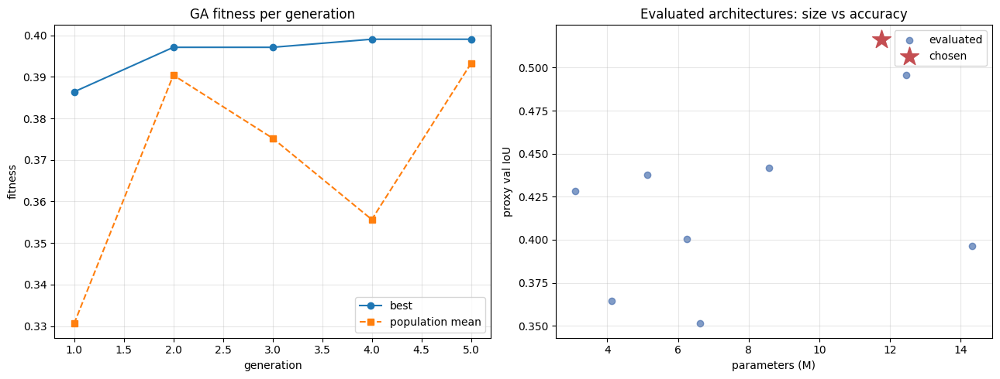
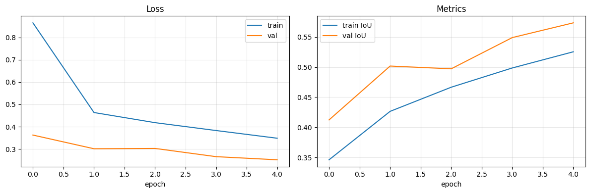
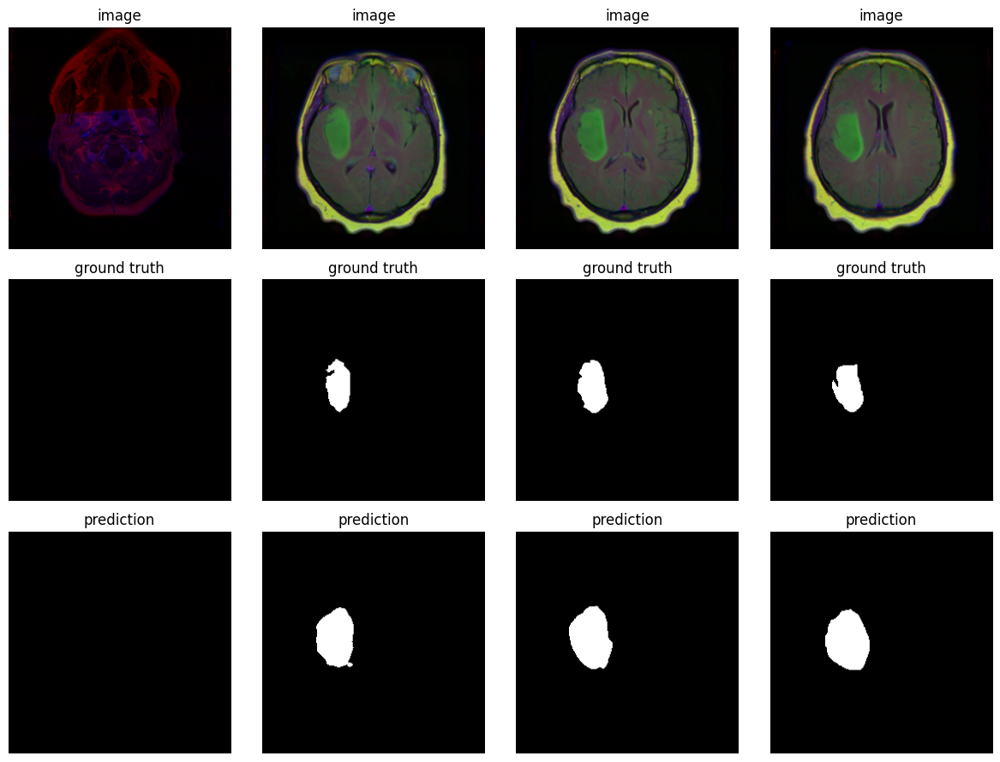

# U-Net NAS — Brain MRI Tumor Segmentation

Neural Architecture Search (NAS) over a U-Net design space for brain-MRI tumor segmentation. A genetic algorithm searches encoder/decoder configurations, scoring each candidate cheaply on a proxy task, then the winning architecture is retrained at full resolution.

## Problem

Binary segmentation of tumor regions from brain MRI slices (`data/mri`, paired `*.tif` images and `*_mask.tif` masks). Train/validation split is done by patient to avoid leakage between adjacent slices of the same subject.

## Method

The search is driven by a genetic algorithm (GA) that optimizes a size-aware fitness:

```
fitness = val_IoU − 0.01 · params(M)
```

This rewards accuracy while penalizing parameter count, biasing the search toward small, efficient models.

**Search space**

| Gene             | Options                                                       |
| ---------------- | ------------------------------------------------------------- |
| Encoder          | `mobileone_s0`, `mobilenet_v2`, `efficientnet-b0`, `resnet18` |
| Decoder channels | `(256,128,64,32,16)`, `(128,64,32,16,8)`, `(64,32,16,8,4)`    |

**GA settings:** population 8, 5 generations, elitism 2, tournament selection (k=3), crossover + mutation (rate 0.3). Evaluated genomes are cached to avoid recomputation.

**Two-stage evaluation**

- _Proxy search_ — 128×128 images, 600-image subset, 4 epochs per candidate (fast scoring).
- _Final training_ — the best genome retrained at 256×256 on the full dataset for 5 epochs.

Loss is a combined **Dice + BCE**; the primary metric is **IoU** (with F1 tracked alongside).

## Results

### Architecture search

The GA's best fitness climbs across generations while the population mean fluctuates as mutation/crossover explore the space. On the size-vs-accuracy plane, the chosen architecture (★) sits at the high-IoU end of the evaluated candidates.



**Best architecture found**

| Property         | Value                |
| ---------------- | -------------------- |
| Encoder          | `resnet18`           |
| Decoder channels | `(64, 32, 16, 8, 4)` |
| Parameters       | 11.74M               |
| On-disk size     | ~47 MB               |

The GA selected the smallest decoder width paired with a compact **ResNet-18** encoder — the lightweight decoder is the main driver of the size reduction.

### Final training (256px, full data)

Train and validation loss fall steadily and IoU rises throughout training, with validation IoU reaching ≈0.57 by epoch 5. The curves are still trending upward, so additional epochs would likely improve results further.



### Qualitative predictions

Predicted tumor masks align closely with the ground truth on validation slices tumor-free slices are correctly left empty.



### Comparison with baseline

| Model                      | Params     | IoU       |
| -------------------------- | ---------- | --------- |
| ResNet34 U-Net (baseline)  | 24.4M      | ≈0.61     |
| **NAS result (ResNet-18)** | **11.74M** | **≈0.57** |

The searched model is ≈2.1× smaller than the ResNet34 baseline while remaining competitive on accuracy, and it was still converging at the end of training.

## Usage

Open and run [nas.ipynb](nas.ipynb) top to bottom:

1.  Build the proxy dataloaders.
2.  Run `genetic_search(...)` to find the best architecture.
3.  Retrain the winning genome at full scale; the best checkpoint is saved to  
    `models/tiny_unet_nas_best.pth`.

**Requirements:** `torch`, `torchvision`, `segmentation_models_pytorch`, `opencv-python`,  
`numpy`, `matplotlib`, `tqdm`, `pydantic`.
